# About the examples

In this section you will find a collection of examples that demonstrate how to use PHP-GLFW. The examples are organized in a way that you can follow the progression of the examples and learn more about the library.

## Basic examples

-   __1. Basic triangle__

    ---

    

-   __2. Basic cube__

    ---

    

-   __3. Textured cube__

    ---

    

-   __4. Instancing__

    ---

    

-  __5. Obj file loader__

    ---

        

- __6. Simple lighting__

    ---

    

- __7. Text rendering__

    ---

    

- __8. Input & Events__

    ---

    

## Vector Graphics examples

<!-- VGEXAMPLES BEGIN -->
### Color

-   __Color Constants__

    ---

    [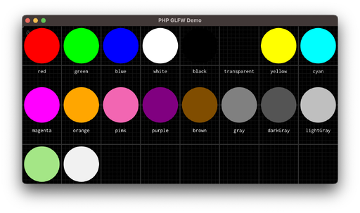](./vector-graphics/color_constants.md)

-   __Color Lightness__

    ---

    [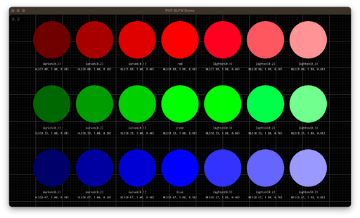](./vector-graphics/color_lightness.md)

### Fun

-   __Visaulizing Bitshifting__

    ---

    [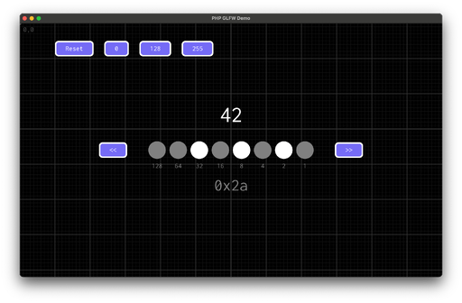](./vector-graphics/fun_bitshifting.md)

-   __Plotting primes__

    ---

    [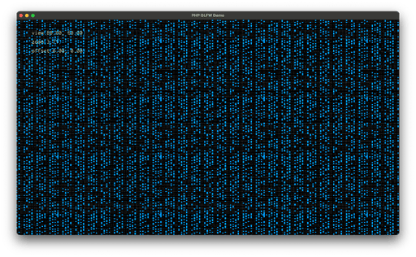](./vector-graphics/fun_primes_1_full.md)

-   __Genetic Car Pathfinding__

    ---

    [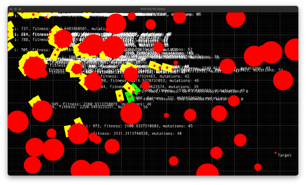](./vector-graphics/ml_genetic_cars.md)

### Gradients

-   __Linear Gradient__

    ---

    [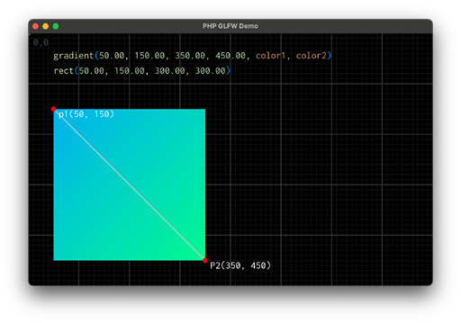](./vector-graphics/gradient_linear.md)

-   __Radial Gradient__

    ---

    [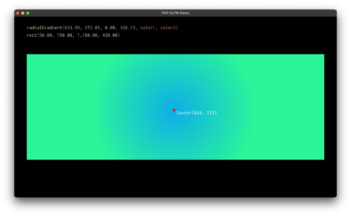](./vector-graphics/gradient_radial.md)

-   __Gradient Wave__

    ---

    [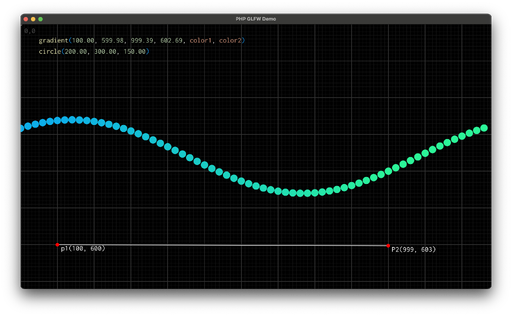](./vector-graphics/gradient_wave.md)

### Images

-   __Image Filtering__

    ---

    [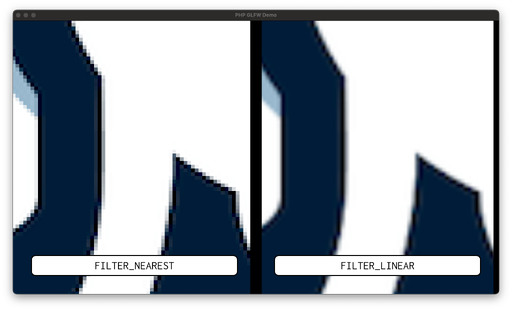](./vector-graphics/images_filtering.md)

-   __Image Repetition__

    ---

    [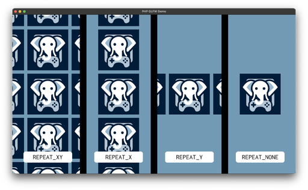](./vector-graphics/images_repeating.md)

-   __Image Rotation__

    ---

    [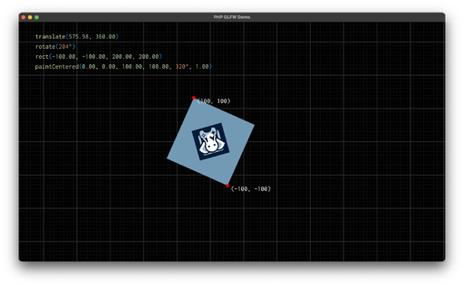](./vector-graphics/images_texture_rotation.md)

### Noise

-   __Noise explorer__

    ---

    [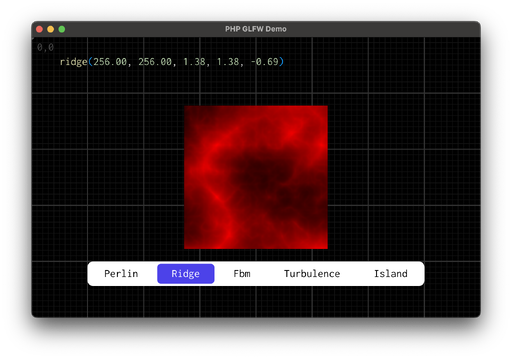](./vector-graphics/noise_explorer.md)

-   __Noise Grid__

    ---

    [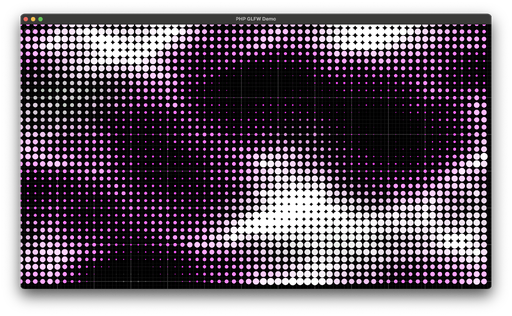](./vector-graphics/noise_grid.md)

### Text

-   __Text Alignment__

    ---

    [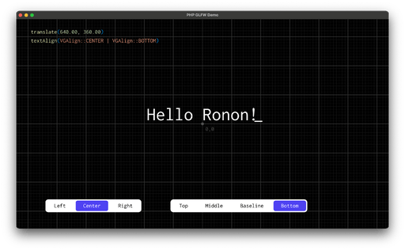](./vector-graphics/text_alignment.md)

-   __Text Boxes__

    ---

    [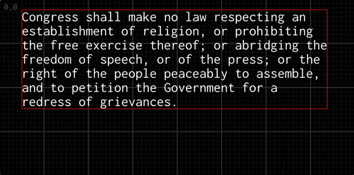](./vector-graphics/text_boxes.md)

-   __Colored Words__

    ---

    [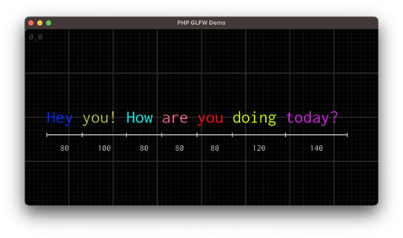](./vector-graphics/text_color_words.md)

-   __Text with Shadow__

    ---

    [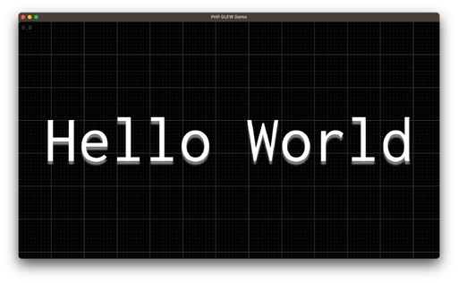](./vector-graphics/text_intro.md)

<!-- VGEXAMPLES END -->

## Advanced examples

-   __10. Sponza Scene__

    ---

    

