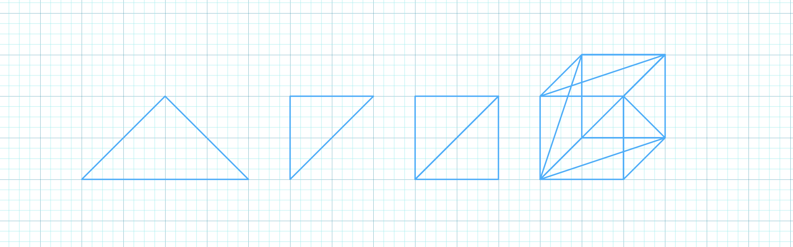

# Drawing a triangle

Now things start to get a bit more interesting and we are going to draw our first triangle. We will use the same window from the previous example, so make sure you have that running.

<figure markdown>
  { width="400" }
  <figcaption>Trinagle drawn in OpenGL with PHP</figcaption>
</figure>

!!! note "Full Source"

    This getting started tutorial is based on the examples provided with PHP-GLFW.  You can check out the complete source code here: [01_triangle.php](https://github.com/mario-deluna/php-glfw/blob/master/examples/01_triangle.php)

## Why a triangle?

Why draw a triangle? Well, it's the simplest geometry you can draw and it's a good starting point to get familiar with the rendering pipeline.
I honestly was kinda blown away when i realized that every object / model / mesh can be represented as a collection of triangles. (That sentence is going to make a few math people mad, execuse the simplyfication) but let me explain.

A square is made up of two triangles, a cube is made up of six squares, a sphere is made up of a bunch of triangles, and so on. So if you can draw a triangle, you can draw anything. (Well, almost anything...)

{ width="100%"}

My next level drawing skills besides, lets talk about the rendering pipeline.

## The rendering pipeline

The rendering pipeline simplified is a series of steps that are executed to transform a 3D model into a 2D image that can be displayed on the screen. The OpenGL pipeline in this example is divided into two parts, the vertex processing and the fragment processing. There are many more steps/stages which we will not cover here to keep things simple. (If you are interested, you can read more about it [here](https://www.khronos.org/opengl/wiki/Rendering_Pipeline_Overview))

Each of these steps/stages are executed by a shader, a small program that is executed on the GPU. The vertex shader is executed for each vertex (point) in the your geometry, and the fragment shader is executed for each pixel on the screen.

Some of these shaders can be programmed by the user. The GPU driver handles others. Shaders are written in a language called GLSL, which is a C-like language with some extensions to make it easier to write shaders.

In PHP-GLFW (PHP OpenGL) you still write your shaders in GLSL. We could have written a transpiler of some sort to convert PHP to GLSL, but that would have been a lot of work and would have made the library a lot more complex, and I also believe it would ultimately defeat the purpose. 

**TO BE CONTINUED**

## Additional resources 

 1. [http://www.opengl-tutorial.org/beginners-tutorials/tutorial-2-the-first-triangle/](http://www.opengl-tutorial.org/beginners-tutorials/tutorial-2-the-first-triangle/)
 2. [https://learnopengl.com/Getting-started/Hello-Triangle](https://learnopengl.com/Getting-started/Hello-Triangle)
