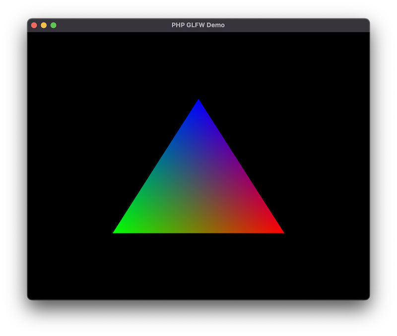

# Drawing a Triangle

Now things start to get a bit more interesting and we are going to draw our first triangle. We will use the same window from the previous example, so make sure you have that running.

<figure markdown>
  { width="400" }
  <figcaption>Trinagle drawn in OpenGL with PHP</figcaption>
</figure>

!!! note "Full Source"

    This getting started tutorial is based on the examples provided with PHP-GLFW.<br> You can check out the complete source code here: [01_triangle.php](https://github.com/mario-deluna/php-glfw/blob/master/examples/01_triangle.php)


## Why a Triangle?

Why draw a triangle? Well, it's the simplest geometry you can draw and it's a good starting point to get familiar with the rendering pipeline.
I honestly was kinda blown away when I realized that every object/model/mesh could be represented as a collection of triangles. (That sentence is going to make a few math people mad) but let me explain.

A square is made up of two triangles. A cube is made up of six squares, and so on. So if you can draw a triangle, you can draw anything. (Well, almost anything...)

{ width="100%"}

My next level drawing skills besides, lets talk about the rendering pipeline.

## The Rendering Pipeline

The rendering pipeline simplified, is a series of steps that are executed to transform a 3D model into a 2D image that can be displayed on the screen. The OpenGL pipeline in this example is divided into two parts, the vertex processing and fragment processing. There are many more steps/stages which we will not cover here to keep things simple. (If you are interested, you can read more about it [here](https://www.khronos.org/opengl/wiki/Rendering_Pipeline_Overview))

Each of these steps/stages is performed by a shader, a small program executed on the GPU. The vertex shader is executed for each vertex (point) in the your geometry, and the fragment shader is executed for each pixel on the screen.

{ width="100%"}

Some of these shaders can be programmed by the user. The GPU driver handles others. Shaders are written in a language called GLSL, which is a C-like language with some extensions to make it easier to write shaders.

In PHP-GLFW (PHP OpenGL) you still write your shaders in GLSL. We could have written a transpiler of some sort to convert PHP to GLSL, but that would have been a lot of work and would have made the library a lot more complex, and I also believe it would ultimately defeat the purpose. 

## Vertex Arrays (VAO and VBO)

In order to draw a triangle, we need to define the vertices that make up the triangle. A vertex array is not necessarily just an array of vertex positions. It can also contain other information such as color, texture coordinates, normals, etc. 

Note the vertex array object (_VAO_) does not directly store the vertices. It holds the state of the vertex array. For example, the _VAO_ stores the vertex attribute configuration, which tells the GPU how to interpret the vertex data. The actual vertex data is stored in the vertex buffer object (_VBO_), which is really just a blob of data.

```php
// create a vertex array (VertextArrayObject -> VAO)
glGenVertexArrays(1, $VAO);

// create a buffer for our vertices (VertextBufferObject -> VBO)
glGenBuffers(1, $VBO);

// bind the buffer to our VAO 
glBindVertexArray($VAO);
glBindBuffer(GL_ARRAY_BUFFER, $VBO);
```

So what is happing here? We are creating a vertex array object (_VAO_) using the [`glGenVertexArrays`](./../API/OpenGL/glGenVertexArrays.md) function. We are also creating a buffer for our vertices using the [`glGenBuffers`](./../API/OpenGL/glGenBuffers.md) function. Using the [`glBindVertexArray`](./../API/OpenGL/glBindVertexArray.md) and [`glBindBuffer`](./../API/OpenGL/glBindBuffer.md) functions we are binding the buffer (_VBO_) and our vertex array object (_VAO_) to the current context.


### Uploading the vertex data

PHP-GLFW provides a few helper classes to make it easier to upload data to the GPU. PHP unfortunately, does not have built-in tools to work with "real" arrays of data (like C/C++). So this extension comes with custom buffer classes that can be used to upload data to the GPU "directly".

So let's declare our triangle vertices and upload them to the GPU using [`glBufferData`](./../API/OpenGL/glBufferData.md).

```{ .php .annotate }
$buffer = new \GL\Buffer\FloatBuffer([ # (1)!
   // positions     // colors
   0.5, -0.5, 0.0,  1.0, 0.0, 0.0,  // bottom right
  -0.5, -0.5, 0.0,  0.0, 1.0, 0.0,  // bottom left
   0.0,  0.5, 0.0,  0.0, 0.0, 1.0   // top 
]);

glBufferData(GL_ARRAY_BUFFER, $buffer, GL_STATIC_DRAW);
```

1.  The [FloatBuffer](./../API/Buffer/FloatBuffer.html) class is just one of many buffer helpers.
    Also available are:
    - [ByteBuffer](./../API/Buffer/ByteBuffer.md)
    - [UByteBuffer](./../API/Buffer/UByteBuffer.html)
    - [ShortBuffer](./../API/Buffer/ShortBuffer.html)
    - [UShortBuffer](./../API/Buffer/UShortBuffer.html)
    - [IntBuffer](./../API/Buffer/IntBuffer.html)
    - [UIntBuffer](./../API/Buffer/UIntBuffer.html)
    - [FloatBuffer](./../API/Buffer/FloatBuffer.html)
    - [HFloatBuffer](./../API/Buffer/HFloatBuffer.html)
    - [DoubleBuffer](./../API/Buffer/DoubleBuffer.html)


But what does the data actually mean? If not clear from the code here a visual representation of the data.

{ width="100%"}

### Vertex attribute pointers

We now know how that buffer data is to be interpreted, but we still need to tell the GPU how to interpret the data. We do this by setting the vertex attribute pointers using the [`glVertexAttribPointer`](./../API/OpenGL/glVertexAttribPointer.md) function.

A vertex attribute pointer consists of 3 central values to allow the GPU to iterate over your vertex data. Lets assume a type uniform vertex buffer for now:

- `size` - The number of components per vertex attribute
- `stride` - The offset between consecutive vertex attributes
- `offset` - The offset of the first component of the vertex attribute


{ width="100%"}

Now in practice the [`glVertexAttribPointer`](./../API/OpenGL/glVertexAttribPointer.md) function is declared like this:

```php
function glVertexAttribPointer(
  int $index,      // Specifies the index of the generic vertex attribute to be modified.
  int $size,       // Specifies the number of components
  int $type,       // Specifies the data type of each component
  bool $normalized,// Specifies whether fixed-point data values should be normalized
  int $stride,     // Specifies the byte offset between consecutive generic vertex attributes
  int $offset      // Specifies a offset of the first component of the first generic vertex attribute 
) : void
```

In case of our triangle we have 6 components per vertex. The first 3 components are the position of the vertex and the last 3 components are the color of the vertex.

```php
// positions
glVertexAttribPointer(0, 3, GL_FLOAT, GL_FALSE, GL_SIZEOF_FLOAT * 6, 0);
glEnableVertexAttribArray(0);

// colors
glVertexAttribPointer(1, 3, GL_FLOAT, GL_FALSE, GL_SIZEOF_FLOAT * 6, GL_SIZEOF_FLOAT * 3);
glEnableVertexAttribArray(1);
```

`$stride` and `$offset` expects the number of bytes. PHP-GLFW exposes the size of the data types as constants. For example `GL_SIZEOF_FLOAT` is the size of a float in bytes. So you can simply multiply the number of components by the size of the data type to get the stride.

I know you probably did not expect a simple triangle to be so complicated. But this is the bare minimum you need to know to get started with OpenGL. In the next section we will look at the shaders.

## Shaders

As we already touch on in [the rendering pipeline](#the-rendering-pipeline), we need to cover two shading stages to render a triangle. The vertex shader and the fragment shader. The vertex shader is responsible for transforming the vertices into clip space. The fragment shader is responsible for calculating the color of each pixel.

### Vertex Shader

The vertex shader is used to transform the input vertices from the vertex buffer object into clip space. This means transforming vertices from 3D space to 2D space, by multiplying them by our projection and view matrix. The output of the vertex shader is the position of the vertex on the screen, as a point in the normalized device coordinates (NDC) space. (i.e., values between -1 and 1).

```glsl
#version 330 core
layout (location = 0) in vec3 position;
layout (location = 1) in vec3 color;

out vec4 pcolor;

void main()
{
    pcolor = vec4(color, 1.0f);
    gl_Position = vec4(position, 1.0f);
}
```

In the above example, we define our vertex shader to expect a vertex position using `layout (location = 0) in vec3 position;` and a color using `layout (location = 1) in vec3 color;`. We then take that `position` and set it as the `gl_Position`. That's it. No fancy math. You can do fancy math in the vertex shader, but we are keeping things simple here. 

This `gl_Position` is how we tell OpenGL where our vertex is in clip space. 

Also notice the `out vec4 pcolor;` to pass the color from the vertex shader to the fragment shader. We will cover this in the next section.

### Fragment Shader

The fragment shader takes as input `pcolor` which represents the color of the current pixel (which we output from the vertex shader), and outputs the final pixel color.

```glsl
#version 330 core

out vec4 fragment_color;
in vec4 pcolor;

void main()
{
    fragment_color = pcolor;
} 
```

Again, not much happening here, we just set the `fragment_color` to the `pcolor` we got from the vertex shader.

### Compiling the shaders

To make use of the shaders we need to compile and link them to a shader program. This requires a few steps:

 1. Create a shader program
 2. Create a vertex shader
 3. Compile the vertex shader
 4. Create a fragment shader
 5. Compile the fragment shader
 6. Attach the vertex shader to the shader program
 7. Attach the fragment shader to the shader program
 8. Link the shader program   

In this example we just define the shader source code as strings. In most applications I worked on we built a system to compile the shaders from the filesystem with an include system etc.. But for this example we will keep it simple.

```php
$vertexShaderSource =  <<< 'GLSL'
#version 330 core
layout (location = 0) in vec3 position;
layout (location = 1) in vec3 color;
out vec4 pcolor;
void main()
{
    pcolor = vec4(color, 1.0f);
    gl_Position = vec4(position, 1.0f);
}
GLSL;

$fragmentShaderSource = <<< 'GLSL'
#version 330 core
out vec4 fragment_color;
in vec4 pcolor;
void main()
{
    fragment_color = pcolor;
} 
GLSL;
```

To create a new shader program we use the [`glCreateProgram`](./../API/OpenGL/glCreateProgram.md) function. This function returns a handle to the shader program. We will use this handle to attach the shaders.

```php
$shaderProgram = glCreateProgram(); // 1. 
```

Next we need to create the vertex shader, load the source code into it and compile it.

```php
// create, upload and compile the vertex shader
$vertexShader = glCreateShader(GL_VERTEX_SHADER); // 2.
glShaderSource($vertexShader, $vertexShaderSource);
glCompileShader($vertexShader); // 3.
```

OpenGL by itself does not throw any exceptions or erros and as we try to stay close to the original API this
holds true for PHP-GLFW as well. So we need to check for errors ourselves. We do this by calling [`glGetShaderiv`](./../API/OpenGL/glGetShaderiv.md) to get the compile status of the shader. If the compile status is not `true` we throw an exception.

```php
// check for errors
glGetShaderiv($vertexShader, GL_COMPILE_STATUS, $success);
if (!$success) {
    throw new Exception("Vertex shader could not be compiled.");
}
```

For the fragment shader we repeat the same steps as for the vertex shader.

```php
// create, upload and compile the fragment shader
$fragShader = glCreateShader(GL_FRAGMENT_SHADER); // 4.
glShaderSource($fragShader, $fragmentShaderSource);
glCompileShader($fragShader); // 5.

// check for errors
glGetShaderiv($fragShader, GL_COMPILE_STATUS, $success);
if (!$success) {
    throw new Exception("Fragment shader could not be compiled.");
}
```

Now we just need to attach the shaders to the shader program and link it.

```php
// attach the shaders to the shader program and link it
glAttachShader($shaderProgram, $vertexShader); // 6.
glAttachShader($shaderProgram, $fragShader); // 7.
glLinkProgram($shaderProgram); // 8.

// check for errors
glGetProgramiv($shaderProgram, GL_LINK_STATUS, $linkSuccess);
if (!$linkSuccess) {
    throw new Exception("Shader program could not be linked.");
}
```

Thats it now we can use the shader with the [`glUseProgram`](./../API/OpenGL/glUseProgram.md) function to draw our triangle.

#### Note on VISU 

To simplify the handling of shaders, it is recommended to abstract the necessary steps. Shader handling can often become complex and cumbersome otherwise. For this purpose, the [VISU Framework](https://github.com/phpgl/visu) offers a range of abstractions for tasks such as shader loading, handling, and compiling, as exemplified by the [ShaderProgram](https://github.com/phpgl/visu/blob/master/src/Graphics/ShaderProgram.php) class.

## Draw loop

Similar to the previous example ["Window Creation"](./window-creation.md) we need to create a draw loop. The draw loop is the main loop of our application. It is responsible for rendering the scene and handling user input. 

Here is the draw loop for our triangle example:

```php
while (!glfwWindowShouldClose($window))
{
     // setting the clear color to black and clearing the color buffer
    glClearColor(0, 0, 0, 1);
    glClear(GL_COLOR_BUFFER_BIT);

    // use the shader, will active the given shader program
    // for the coming draw calls.
    glUseProgram($shaderProgram);

    // bind & draw the vertex array
    glBindVertexArray($VAO);
    glDrawArrays(GL_TRIANGLES, 0, 3);

    // swap the windows framebuffer and
    // poll queued window events.
    glfwSwapBuffers($window);
    glfwPollEvents();
}
```

Now in details what do these new lines of code do?

```php
glUseProgram($shaderProgram);
```

The [`glUseProgram`](./../API/OpenGL/glUseProgram.md) function activates the given shader program. This means that all draw calls after this function will use the given shader program. Again OpenGL is a state machine and we are responsible for setting the correct state. 

```php
glBindVertexArray($VAO);
```

The [`glBindVertexArray`](./../API/OpenGL/glBindVertexArray.md) function binds the given vertex array object. This means that all draw calls after this function will use the given vertex array object. This vertex array contains our triangle vertices and colors if you rember.

```php
glDrawArrays(GL_TRIANGLES, 0, 3);
```

The [`glDrawArrays`](./../API/OpenGL/glDrawArrays.md) function then instructs OpenGL to draw the vertices as triangles. The first parameter is the primitive type, in this case triangles. The second parameter is the starting index of the vertex array and the third parameter is the number of vertices we want to draw.

## Full Source Code

The full source code can be found here: [01_triangle.php](https://github.com/mario-deluna/php-glfw/blob/master/examples/01_triangle.php)

## Additional resources 

 1. [https://www.khronos.org/opengl/wiki/Vertex_Specification](https://www.khronos.org/opengl/wiki/Vertex_Specification)
 2. [http://www.opengl-tutorial.org/beginners-tutorials/tutorial-2-the-first-triangle/](http://www.opengl-tutorial.org/beginners-tutorials/tutorial-2-the-first-triangle/)
 3. [https://learnopengl.com/Getting-started/Hello-Triangle](https://learnopengl.com/Getting-started/Hello-Triangle)
