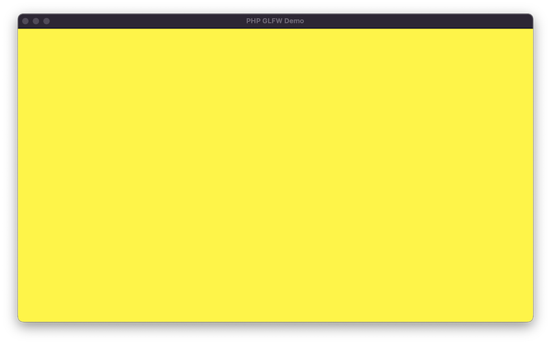
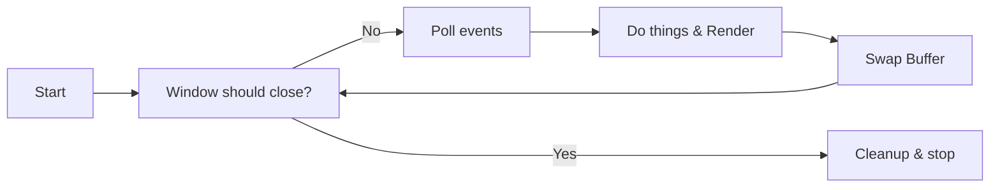

# Opening a Window

Before we get to drawing anything, we need to open a window and create a context in which we can actually draw in. This requires some boilerplate code which we discuss in this guide.

Opening a window is a operating system specific task, so we usally would have to write a different program for each platform. However, as the name of this extension suggests _PHP-GLFW_ is built on top of the [GLFW](http://www.glfw.org/) library, which provides a cross-platform API for opening a window, creating a context and receiving input events for us. Having plattform specific code in PHP just doesnt feel right, so we use GLFW to do the dirty work for us.

!!! question "PHP-GLFW already installed?"

    Follow the **[installation guide](./installation/install-linux.md)** if you **haven't** installed the extension yet!


<figure markdown>
  { width="400" }
  <figcaption>GLFW Window with OpenGL context in PHP.</figcaption>
</figure>

Not a very exciting screenshot, I know. But first things first, the fun stuff is coming later.

!!! note "Full Source"

    This getting started tutorial is based on the examples provided with PHP-GLFW.<br> You can check out the complete source code here: [01_triangle.php](https://github.com/mario-deluna/php-glfw/blob/master/examples/01_triangle.php)


## Initalizing GLFW 

At the very beginning we want to call [glfwInit](./../API/GLFW/glfwInit.md), which you probably can guess from the name will initialize GLFW. 

GLFW is a multi-platform library that handles window creation, input & context for us.

```php
if (!glfwInit()) {
    throw new Exception('GLFW could not be initialized!');
}
```

## Creating a Window

Using the function [glfwWindowHint](./../API/GLFW/glfwWindowHint.md) we can declare properties / options aka hints for the to be created window.

```php
// allow the window to be resized by the user
glfwWindowHint(GLFW_RESIZABLE, GL_TRUE);

// set the OpenGL context version and profile 
glfwWindowHint(GLFW_CONTEXT_VERSION_MAJOR, 4);
glfwWindowHint(GLFW_CONTEXT_VERSION_MINOR, 1);
glfwWindowHint(GLFW_OPENGL_PROFILE, GLFW_OPENGL_CORE_PROFILE);

// enable forward compatibility, @see glfw docs for details
glfwWindowHint(GLFW_OPENGL_FORWARD_COMPAT, GL_TRUE);
```

After declaring the window hints we can call the [glfwCreateWindow](./../API/GLFW/glfwCreateWindow.md) to create a window resource. Hints like `GLFW_RESIZABLE` are completely optional.

```php 
if (!$window = glfwCreateWindow(800, 600, "PHP GLFW Demo")) {
    throw new Exception('OS Window could not be initialized!');
}
```

`$window` is now an instance of the `GLFWwindow` class, which holds the internal resource to the actual window.

The first two parameters are the width and height of the window in pixels. The third parameter is the title of the window.
If the window creation fails, the function returns `NULL` and we throw an exception.

## Binding GL Context

By calling [glfwMakeContextCurrent](./../API/GLFW/glfwMakeContextCurrent.md) glfw will make the given window object the one that is bound to the current GL context.
In other words, all GL commands will be executed in the context of this window. Special in PHP-GLFW is that this will also initialize [glad](https://github.com/Dav1dde/glad).

```php
glfwMakeContextCurrent($window);
```

Because I don't particularly appreciate it when my notebook sounds like a jet engine, I enable V-Sync next so that frames are not swapped faster
then the displays refresh rate.

```{ .php .annotate }
glfwSwapInterval(1); #(1)
```

1.  Check [glfwSwapInterval](./../API/GLFW/glfwSwapInterval.md) 


## Main Loop

Because we want the application to run as long as the user wishes to, we have to create a "main loop". 
Basically, a subroutine that keeps on running until we want to exit the application.

In our main loop, we got to take care of a few things, a simplified common main loop looks something like this:



To make this example a bit more interesting, we change the clear color based on the current mouse position.

```{ .php .annotate }
while (!glfwWindowShouldClose($window))
{
    glfwPollEvents();
    
    // setting the clear color to black and clearing the color buffer
    glfwGetCursorPos($window, $mouseX, $mouseY); # (1)!
    glClearColor(sin($mouseX / 300), sin($mouseY / 300), cos($mouseY / 300), 1);
    glClear(GL_COLOR_BUFFER_BIT);

    // swap the windows framebuffer and
    // poll queued window events.
    glfwSwapBuffers($window);
}
```

1.  Check out [glfwGetCursorPos](./../API/GLFW/glfwGetCursorPos.md) for more information.
    It will return the last known mouse position in the given window.


Glfw holds an internal state which can be fetched using [`glfwWindowShouldClose`](./../API/GLFW/glfwWindowShouldClose.md), which will also return true if the user requested to close the window. (By clicking the close icon on the window for example).

In the loop, the function [`glfwPollEvents`](./../API/GLFW/glfwPollEvents.md) will poll all queued window events and call the appropriate callback functions. Calling this function continuously is important to make sure that the window is responsive to user input and does not freeze.

```php
glfwGetCursorPos($window, $mouseX, $mouseY);
glClearColor(sin($mouseX / 300), sin($mouseY / 300), cos($mouseY / 300), 1);
glClear(GL_COLOR_BUFFER_BIT);
```

Here we simply get the current mouse position and use it to set the clear color. The clear color is used to clear the color buffer before rendering a new frame. Think of it as the background color of the window.

Finally in the loop we call [`glfwSwapBuffers`](./../API/GLFW/glfwSwapBuffers.md) to swap the windows framebuffer with the one that is currently being rendered to. This is a double buffered window, which means that there are two framebuffers, one that is currently being rendered to and one that is currently being displayed. By swapping the buffers, we make the rendered frame visible to the user.

For good mesure, let's clean up after the loop.

```php
glfwDestroyWindow($window);
glfwTerminate();
```

## Demo 

Here you go, a colored window! Not the peak of excitement, but we are getting there slowly.

<div class="video-wrapper">
 <iframe width="1280" height="720" src="https://www.youtube-nocookie.com/embed/kjKIdooEUH0" frameborder="0" allowfullscreen></iframe>
</div>

Next up we are going to create our first geometry and render a triangle in our window.

## Full Source Code

```php
<?php
if (!glfwInit()) {
    throw new Exception('GLFW could not be initialized!');
}

glfwWindowHint(GLFW_RESIZABLE, GL_TRUE);
glfwWindowHint(GLFW_CONTEXT_VERSION_MAJOR, 4);
glfwWindowHint(GLFW_CONTEXT_VERSION_MINOR, 1);
glfwWindowHint(GLFW_OPENGL_PROFILE, GLFW_OPENGL_CORE_PROFILE);
glfwWindowHint(GLFW_OPENGL_FORWARD_COMPAT, GL_TRUE);

if (!$window = glfwCreateWindow(800, 600, "PHP GLFW Demo")) {
    throw new Exception('OS Window could not be initialized!');
}

glfwMakeContextCurrent($window);
glfwSwapInterval(1);

while (!glfwWindowShouldClose($window))
{
    glfwPollEvents();
    glfwGetCursorPos($window, $mouseX, $mouseY);
    glClearColor(sin($mouseX / 300), sin($mouseY / 300), cos($mouseY / 300), 1);
    glClear(GL_COLOR_BUFFER_BIT);
    glfwSwapBuffers($window);
}

glfwDestroyWindow($window);
glfwTerminate();
```

## Additional resources 

 1. [https://www.glfw.org/docs/latest/window_guide.html](https://www.glfw.org/docs/latest/window_guide.html)
 2. [https://learnopengl.com/Getting-started/Hello-Window](https://learnopengl.com/Getting-started/Hello-Window)
