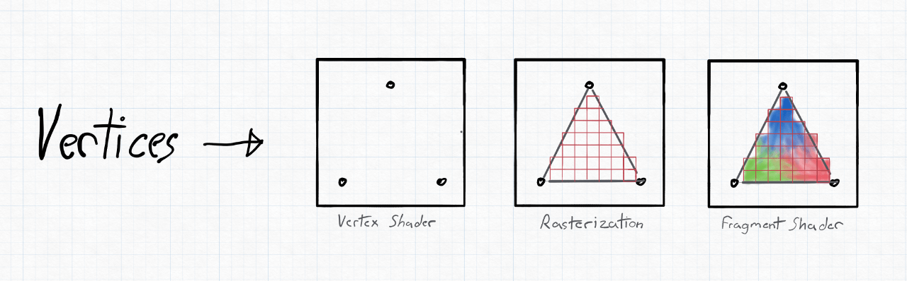
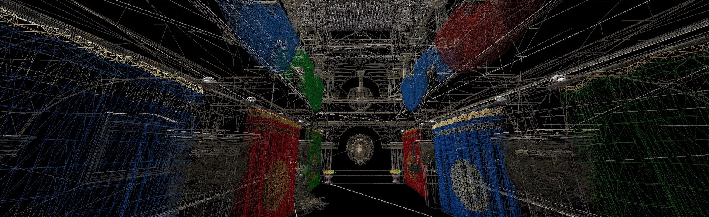

---
hide:
  - navigation
---

# PHP-GLFW: An OpenGL and GLFW Extension for PHP

**A fully-featured OpenGL and GLFW extension for PHP. Batteries included 🔋!**

[](https://github.com/mario-deluna/php-glfw/actions/workflows/build.yml)

PHP-GLFW allows you to create _2D_ and _3D_ real-time applications in _PHP_. Bringing a whole different set of tools into the PHP world to develop graphical applications like _games, scientific simulations, user interfaces_, and more.

<div class="grid cards" markdown>

-   :material-clock-fast:{ .lg .middle } __Install in 5 minutes__

    ---

    If you haven't installed PHP-GLFW yet, follow the installation guide for your platform.

    [:octicons-arrow-right-24: Installation **Linux**](./getting-started/installation/install-linux.md)

    [:octicons-arrow-right-24: Installation **MacOS**](./getting-started/installation/install-macos.md)
    
    [:octicons-arrow-right-24: Installation **Windows**](./getting-started/installation/install-windows.md)

-   :material-lightbulb:{ .lg .middle } __PHP OpenGL Tutorial__

    ---

    { width="100%"}

    Everything ready to get started? Jump right into the first chapter of the tutorial.

    [:octicons-arrow-right-24: Getting Started (Create Window)](./getting-started/window-creation.md)

-   :material-book:{ .lg .middle } __API Docs__

    ---

    Checkout the API documentation for all the functions and classes available in PHP-GLFW.

    [:octicons-arrow-right-24: GLFW](./API/GLFW/glfwCreateWindow.md)
    
    [:octicons-arrow-right-24: OpenGL](./API/OpenGL/glBufferData.md)

    [:octicons-arrow-right-24: Buffers](./API/Buffer/ByteBuffer.md)

    [:octicons-arrow-right-24: Math](./API/Math/Vec4.md)

    [:octicons-arrow-right-24: Geometry](./API/Geometry/ObjFileParser.md)

-   :material-play-circle:{ .lg .middle } __Examples__

    ---

    { width="100%"}

    Want to directly dig into example code? Check out the examples folder.

    [:octicons-arrow-right-24: Examples](./examples/00-about-examples.md)
</div>

## What is this extension? Features 🚀

PHP-GLFW aims to be one extension containing all basics you need to start building graphical applications in PHP. That means that PHP-GLFW does **NOT only** provide GLFW library bindings. Instead, it also **includes OpenGL bindings** and a bunch of classes and helpers pretty much required for building these types of applications.

### OpenGL 

* Full native support of **OpenGL** (4.1+ core), GPU accelerated rendering in PHP.
* Targeting OpenGL 4.1, but it can also be built for newer versions.
* Support for OpenGL extensions (limited).
* Mostly mirroring the C API, adjustments were made where required or otherwise nonsensical.
* We currently support about ~90% of the full standard, check [GLSUPPORT.md](./GLSUPPORT.md)

### GLFW 

This extension comes obviously with bindings for the amazing **[GLFW](https://www.glfw.org)** library. GLFW comes with great features, to name a few:

* Multiplatform window creation and handling (macOS, Windows, Linux)
* Support for multiple windows and monitors
* Real-time user input handling
  * **Keyboard and Mouse** event handling
  * **Joystick** input support

### PHPGL - Math

PHPGL is what I call the extras in this extension, aka classes and helpers additionally provided that are pretty much a requirement for these kinds of applications. PHP-GLFW comes with a mathematics library written in C, covering the most common operations required for graphical applications.

* Supported structs: `Vec2`, `Vec3`, `Vec4`, `Mat4`, and `Quat`
* Includes most common matrix operations for the use case like: `lookAt`, `perspective`, `inverse`, `rotate`, etc.

Having this integrated into the extension comes with a bunch of advantages:

* It's fast
* Low memory footprint
* The math structures have overloaded operators, so you can write things like:
  ```php
  use GL\Math\Vec2;
  $v3 = Vec2(15, -5) + Vec2(42, 7); // returns Vec2(54, 2)
  ```
* Some OpenGL functions can directly accept the math structs as arguments

1. [Read more about math functions](https://phpgl.net/user-guide/math_functions.html)

### PHPGL - Buffers

This extension also contains a collection of buffer objects that internally hold data in native types.

* Can handle large arrays of data
* Low memory footprint and very fast
* Data is stored internally to be directly uploadable to the GPU

1. [Read more about the buffers](https://phpgl.net/API/Buffer/FloatBuffer.html)

### PHPGL - Textures

PHP-GLFW supports the loading of images/textures into buffers without requiring an additional extension:

* Can load common image formats such as `jpg`, `png`, `tga`, `bmp`, `gif` (_gd or Imagick is not required_)
* Can write images/textures back to disk
* Writes data into a `BufferInterface` object, giving full access to the bitmap from userland

1. [Read more about texture loading](https://phpgl.net/API/Texture/Texture2D.html)

### PHPGL - Geometry

PHP-GLFW also comes with a `.obj` Wavefront file loader. This allows you to load and parse `.obj` files. We also provide a few helpers 
to generate tangent and bitangent vectors for the loaded geometry directly. Currently, we only support triangulated geometry and no quads.

* Can parse `.obj` and `.mtl` files
* Can generate the normal, tangent, and bitangent vectors for the loaded geometry on the fly
* Allows you to extract separate meshes and groups from the loaded geometry
* Can group the vertices by their material
* Can reindex extracted meshes to reduce the number of vertices

1. [Read more about geometry loading](https://phpgl.net/API/Geometry/ObjFileParser.html)

### How are the bindings achieved?

Instead of porting function by function manually, PHP-GLFW parses the OpenGL specs to generate most of this C extension. Adjustments are made manually where necessary.
