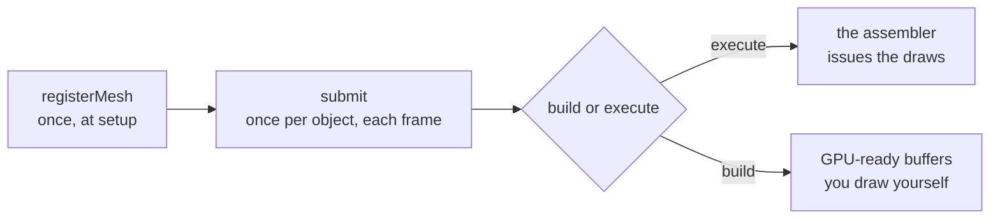

# Draw Call Assembler

Rendering a handful of objects in PHP is easy: loop over your meshes, set a couple of uniforms, and issue a draw call for each one. But the moment your scene grows into a forest, a crowd, or an asteroid field, that friendly little loop turns into your biggest bottleneck. Thousands of individual draw calls, thousands of redundant state changes, and a CPU that spends all its time *talking* to the GPU instead of letting it draw.

The [`GL\Rendering\DrawCallAssembler`](/API/Rendering/DrawCallAssembler.html) exists to take that work off your hands. You describe your scene one object at a time ("draw this mesh, with this transform, in this material"), and the assembler does the heavy lifting in native C: it culls everything outside the camera's view, picks a level of detail per object, sorts the draws to minimize state changes, and collapses identical objects into instanced batches. Then it either draws the whole thing for you, or hands you back GPU-ready buffers to draw yourself.

{ width="100%" }

How well does that work? The bundled example renders a **10-million-instance** asteroid field. On an M1 MacBook, with octree culling most of the field falls outside the frustum, and a typical frame looks like this:

```text
octree | submitted 10000000, visible 35 (100.0% culled), draw calls: 28, avg execute: 2.129ms, avg frame: 8.558ms (116.9 FPS)
```

This page gets you a working assembler running. From there, each capability has its own focused page:

- [Render Paths](/user-guide/rendering/render-paths.html): let the assembler draw for you, or take the wheel with the packed command buffers.
- [Culling & LOD](/user-guide/rendering/culling-and-lod.html): skip what the camera can't see, and swap in cheaper meshes with distance.
- [Sorting & Batching](/user-guide/rendering/sorting-and-batching.html): passes, draw order, and collapsing draws into instanced batches.
- [Per-Instance Payloads](/user-guide/rendering/payload-attributes.html): send arbitrary per-instance data (like colors) along as vertex attributes.

Every constant, property, and method is listed in the [`DrawCallAssembler` API reference](/API/Rendering/DrawCallAssembler.html).

Want to see it in motion first? Two runnable demos ship with the extension:

```bash
# octree culling + LOD over a huge asteroid field
php examples/09_drawcall_assembler.php

# per-instance colors via payload attributes (50k instances)
php examples/10_drawcall_assembler_with_payload.php
```

## How It Fits Together

Before we touch any code, let's build a quick mental model. It makes everything else feel less magical.

The assembler works in three beats:

1. **Register your meshes, once.** You tell the assembler about each mesh (its VAO, how to draw it, its bounding box) and get back a small integer *handle*. You do this during setup, not every frame.
2. **Submit instances, every frame.** For each object you want on screen, you `submit()` a mesh handle plus a transform (and optionally a material, render pass, and flags). This is cheap, since you're just recording intent, not drawing yet.
3. **Build or execute.** Once everything is submitted, the assembler culls, sorts, LOD-selects, and batches the whole scene in one native pass. From here you either let it draw for you, or grab the packed buffers and draw yourself. That's the [Render Paths](/user-guide/rendering/render-paths.html) page.



That's the whole loop. Register once, submit-and-build each frame. If some of the terms above don't click yet, don't worry, because each one has its own section and we'll get to them.

## A Minimal Example

Let's start with the smallest possible working setup so you can see the shape of it. We'll draw a single mesh a few times, and let the assembler issue the draws.

First, during setup, create an assembler and register a mesh. `registerMesh` returns a handle you'll use for the rest of the program:

```php
use GL\Rendering\DrawCallAssembler;
use GL\Math\{Mat4, Vec3};

$assembler = new DrawCallAssembler();

// $vao is a vertex array object you've already created and filled
$shipHandle = $assembler->registerMesh(
    vao: $vao,
    vertexCount: $vertexCount,
);

// tell the assembler which attribute locations the instance transform occupies.
// the 4x4 matrix takes four consecutive vec4 slots, here locations 2, 3, 4, 5.
$assembler->bindTransformBuffer($vao, 2);
```

Then, inside your render loop, submit an instance per object and let the assembler draw them:

```php
// clear last frame's instances, then record this frame's
$assembler->clearInstances();

foreach ($ships as $ship) {
    $transform = new Mat4;
    $transform->translate($ship->position);

    $assembler->submit(
        meshHandle: $shipHandle,
        transform: $transform,
        materialId: 0,
    );
}

// the assembler binds the VAO and issues the draws; your callback runs
// once before each draw so you can set uniforms, bind textures, etc.
$assembler->execute(function (int $meshHandle, int $materialId, int $instanceOffset, int $instanceCount, int $flags) {
    // nothing extra needed for this simple case
});
```

That's a complete, working assembler loop. Everything on the other pages adds capabilities to this same skeleton, one idea at a time.

## Registering Your Meshes

Every object you draw starts life as a *registered mesh*. Registration tells the assembler how to draw the geometry, and hands you back a numeric handle to refer to it later:

```php
$shipHandle = $assembler->registerMesh(
    vao: $vao,
    vertexOffset: 0,
    vertexCount: $vertexCount,
    indexOffset: 0,
    indexCount: 0,
    aabbMin: $aabbMin,
    aabbMax: $aabbMax,
    materialHint: 0,
    primitive: GL_TRIANGLES,
);
```

A few notes on the arguments you'll reach for most:

- Leave `indexCount` at `0` to draw arrays; pass a non-zero `indexCount` (with an `indexOffset`) to draw indexed geometry from an element buffer instead.
- `aabbMin` and `aabbMax` are the corners of the mesh's axis-aligned bounding box, as [`Vec3`](/API/Math/Vec3.html) values. They're optional, but the assembler uses them for [frustum culling and LOD](/user-guide/rendering/culling-and-lod.html), so if you plan to cull, you'll want to provide them. If you loaded the mesh with the [`ObjFileParser`](/API/Geometry/ObjFileParser.html), its meshes already expose `aabbMin` / `aabbMax` for you (see [Wavefront Object Files](/user-guide/geometry/wavefront-object-files.html)).

!!! tip
    You own everything you pass in. The assembler stores your VAO handle and bounding box but never modifies, uploads, or deletes your buffers. That stays your responsibility.

### Setting a Mesh's Material

Each mesh carries a default material id, taken from the `materialHint` you registered it with. If you'd like to change it later, you may:

```php
$assembler->setMeshMaterial($shipHandle, materialId: 3);
```

This is only the *default*. Any individual `submit()` can still override the material for that one instance.

## Submitting Instances Each Frame

Once your meshes are registered, drawing a frame is a matter of submitting one instance per visible object. Each `submit()` records a single appearance of a mesh in the world:

```php
$assembler->submit(
    meshHandle: $shipHandle,
    transform: $transform,   // a GL\Math\Mat4 world transform
    materialId: 2,
    pass: DrawCallAssembler::PASS_OPAQUE,
    programId: 0,
    flags: 0,
    sortBias: 0.0,
    userId: $index,
);
```

Only the first three arguments are required; the rest have sensible defaults. The ones worth knowing:

- `pass` groups the draw into a render pass: opaque, transparent, depth, or a user pass. See [Sorting & Batching](/user-guide/rendering/sorting-and-batching.html).
- `programId` is an identifier for the shader program this instance uses. The assembler sorts and batches by it so it can keep like-shaded draws together, minimizing program switches.
- `flags` is a bitmask of `FLAG_*` overrides, for example forcing an instance to skip culling or opt out of instancing.
- `sortBias` nudges an instance earlier or later in the sorted order, handy for resolving z-fighting or forcing a decal to draw last.
- `userId` is yours to use: it's copied verbatim into the metadata buffer, so you can map a drawn instance back to your own scene object.

Remember to call `clearInstances()` at the top of each frame before you start submitting, otherwise this frame's objects pile on top of last frame's:

```php
$assembler->clearInstances();
// ... submit this frame's instances ...
```

!!! tip "Static scenes: submit once, replay every frame"
    If your instances never move and only the camera does, you don't have to resubmit them each frame. Submit once, then simply build (or execute) again on later frames with a new camera. The assembler re-culls and re-sorts against the new view without you touching the instance list. This is exactly what makes the [octree culling strategy](/user-guide/rendering/culling-and-lod.html) shine.

## Cleaning Up and Reusing an Assembler

For the common per-frame case you'll almost always want plain `clearInstances()`, which wipes the submitted instances but keeps your registered meshes intact. When you need to tear more down, two lifecycle helpers round things out. `clearMeshes()` drops every registered mesh and releases the associated buffers, while `reset()` clears both the mesh registry *and* the current frame's instances, returning the assembler to a fresh state:

```php
$assembler->clearMeshes(); // forget all registered meshes
$assembler->reset();       // forget meshes and instances both
```

## Where to Next

You now have objects on screen. From here, pick whichever problem you have:

- Need full control over the draws, or want to inspect what the assembler produced? See [Render Paths](/user-guide/rendering/render-paths.html).
- Scene too big to draw all of it? See [Culling & LOD](/user-guide/rendering/culling-and-lod.html).
- Transparency out of order, or too many draw calls? See [Sorting & Batching](/user-guide/rendering/sorting-and-batching.html).
- Every instance needs its own color or custom data? See [Per-Instance Payloads](/user-guide/rendering/payload-attributes.html).
