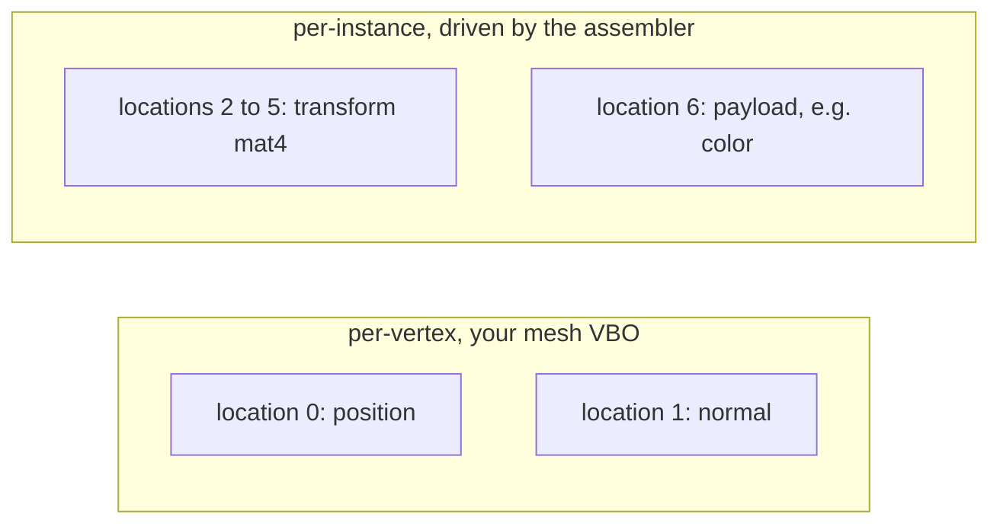

# Per-Instance Payloads

[Instanced batching](/user-guide/rendering/sorting-and-batching.html) draws thousands of objects in one call, but if every object needs a different color, and color comes from a uniform, you're forced to break the batch to set that uniform. Payloads solve this. A *payload* is a block of arbitrary per-instance floats (a color, a set of skinning weights, whatever your shader wants) that travels alongside the transform as a vertex attribute. No uniforms, no broken batches.

{ width="100%" }

Every one of those 200 ships carries its own color, yet the whole grid is a single draw call. Had that color come from a uniform, you would have paid one draw call per color: 200 of them. The color instead rides along as a per-instance vertex attribute, so the batch never has to break.

Let's wire up per-instance color, the way `examples/10_drawcall_assembler_with_payload.php` does. You can run that demo yourself:

```bash
# per-instance colors via payload attributes (50k instances)
php examples/10_drawcall_assembler_with_payload.php
```

## Reading the Payload in Your Shader

First, your shader reads the instanced transform *and* the payload as vertex attributes. The transform matrix occupies four consecutive locations (2 to 5), so the color payload starts at location 6:

```glsl
#version 330 core
layout (location = 0) in vec3 a_position;
layout (location = 1) in vec3 a_normal;

// transform matrix (instanced), occupies locations 2, 3, 4, 5
layout (location = 2) in mat4 i_transform;

// per-instance color (instanced payload), location 6
layout (location = 6) in vec3 i_color;

// ...
```

The attribute locations line up like this: your mesh owns the low locations, the assembler drives the transform across the next four, and your payload picks up right after.



## Filling and Binding the Payload

On the PHP side you fill a [`FloatBuffer`](/API/Buffer/FloatBuffer.html) with one payload entry per instance, **in submission order**, and tell the assembler how many floats each entry has:

```php
use GL\Buffer\FloatBuffer;

$payloadBuffer = new FloatBuffer();
foreach ($asteroids as $asteroid) {
    // push 3 floats (RGB) per instance, matching submission order
    $payloadBuffer->pushArray([$asteroid->r, $asteroid->g, $asteroid->b]);
}

// 3 floats per instance
$assembler->bindPayloadData($payloadBuffer, 3);
```

Then, during setup, wire the attributes onto each VAO. `bindTransformBuffer` returns the next free attribute location so you don't have to count by hand, and `bindPayloadBuffer` sets up the payload attribute:

```php
// transform goes to locations 2,3,4,5; returns 6, the next free location
$assembler->bindTransformBuffer($vao, 2);

// payload (color) goes to location 6
$assembler->bindPayloadBuffer($vao, 6);
```

## Drawing

Finally, build or execute as usual. The assembler shuffles your payload into the same sorted, culled order as the instances, so `i_color` always lines up with the right object, even after culling reorders everything:

```php
$assembler->execute(function (int $meshHandle, int $materialId, int $instanceOffset, int $instanceCount, int $flags) use ($meshRegistry) {
    glBindVertexArray($meshRegistry[$meshHandle]['vao']);
    // no per-instance material uniform needed, color rides along as a vertex attribute
});
```

!!! warning
    Call `bindPayloadData()` (to register the buffer and stride) and `bindPayloadBuffer()` (to set up the attribute) *after* `bindTransformBuffer()`, and set up the payload attribute before your draws. If you regenerate the payload buffer mid-run, call `bindPayloadData()` again so the assembler picks up the new data. Passing a `stride` of `0` to `bindPayloadBuffer()` reuses the stride you gave `bindPayloadData()`.
